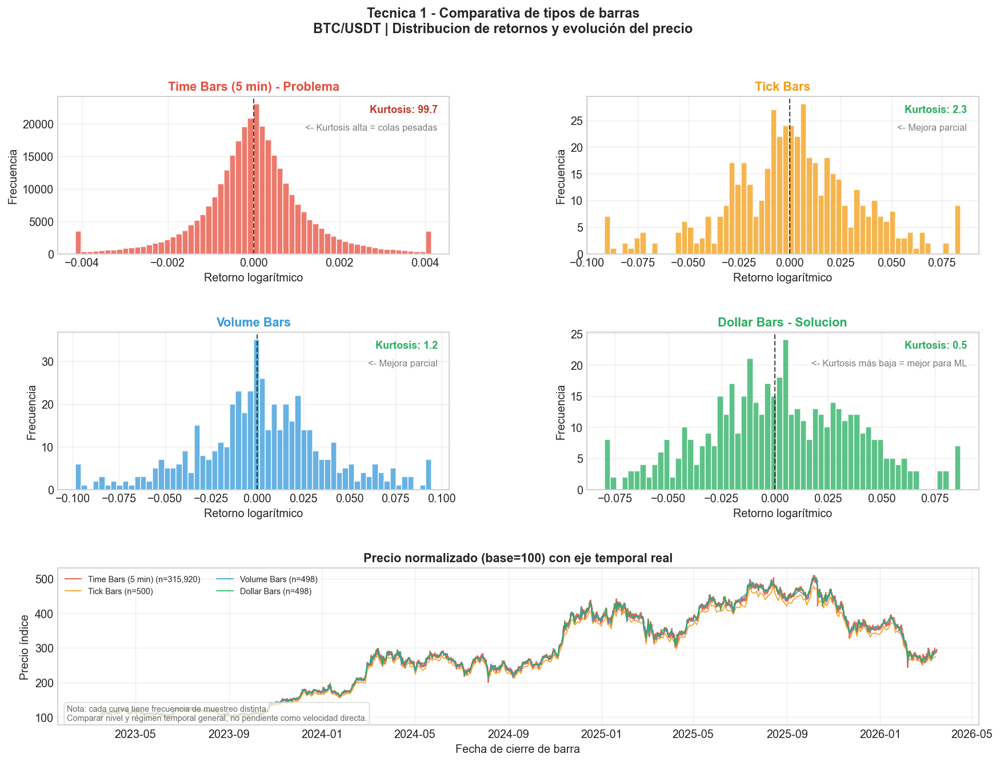
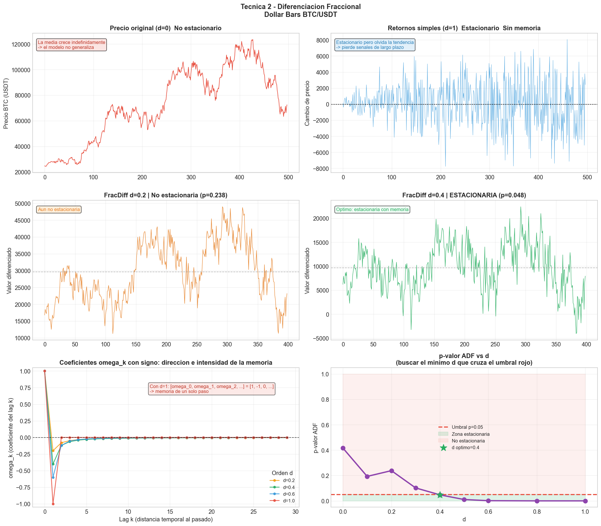
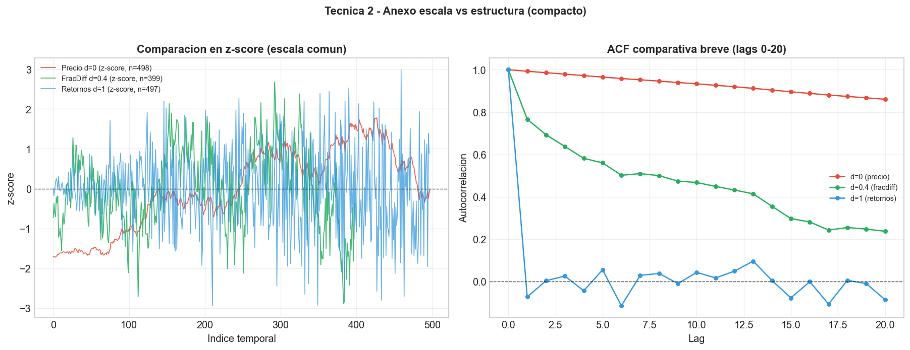
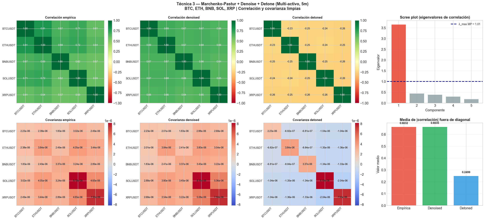
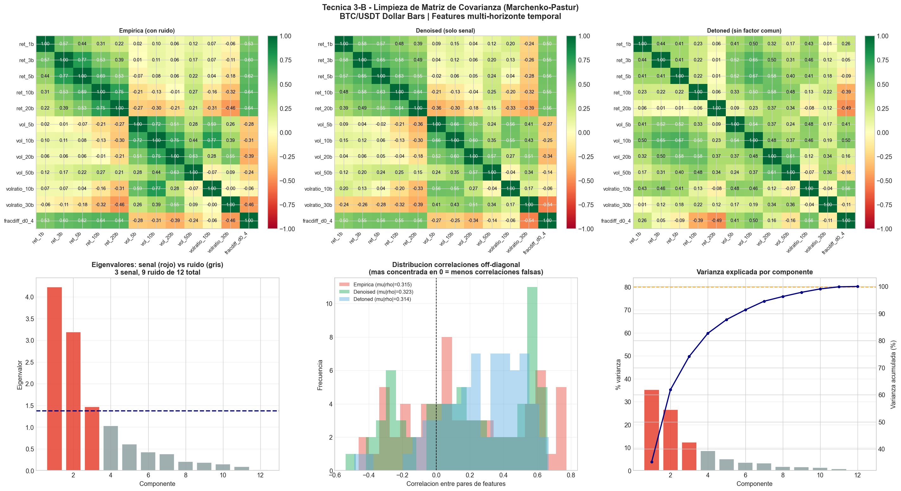
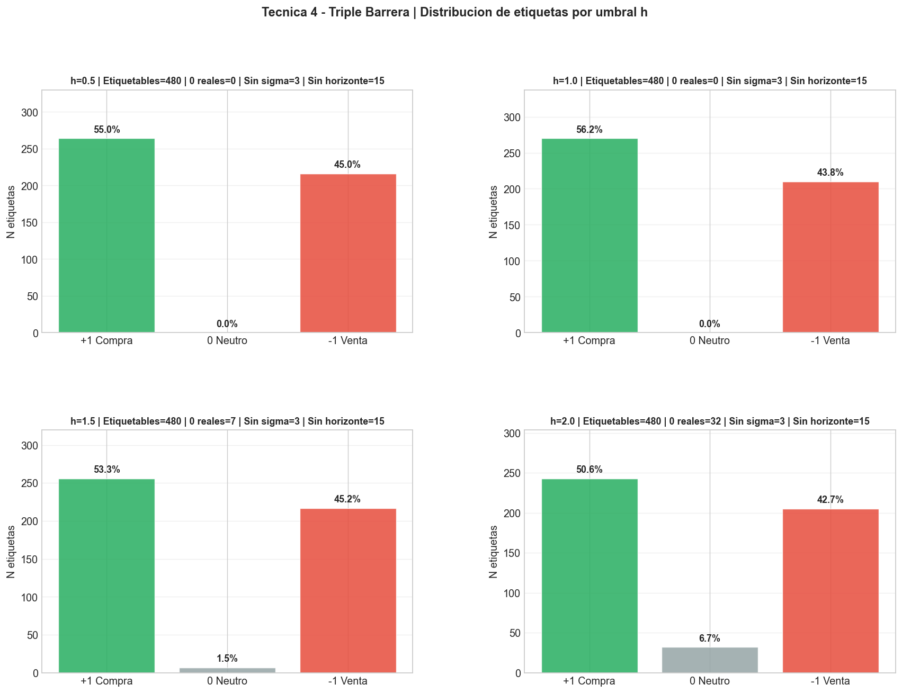
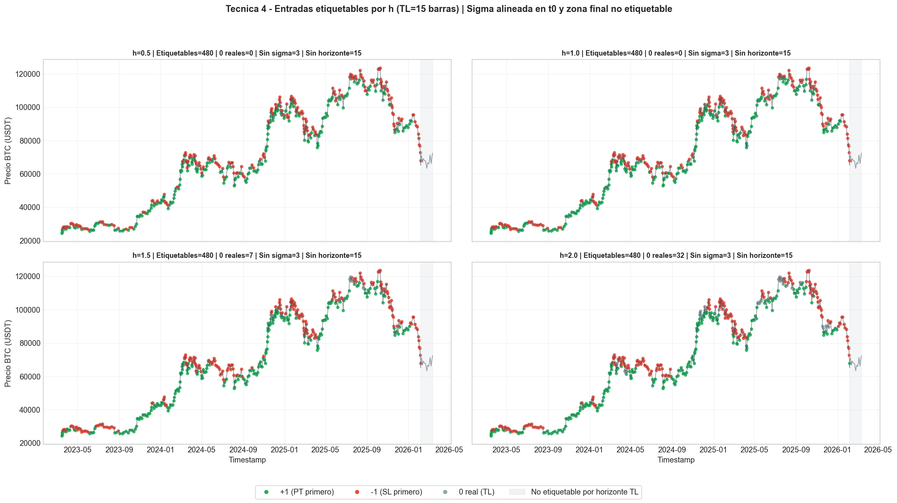
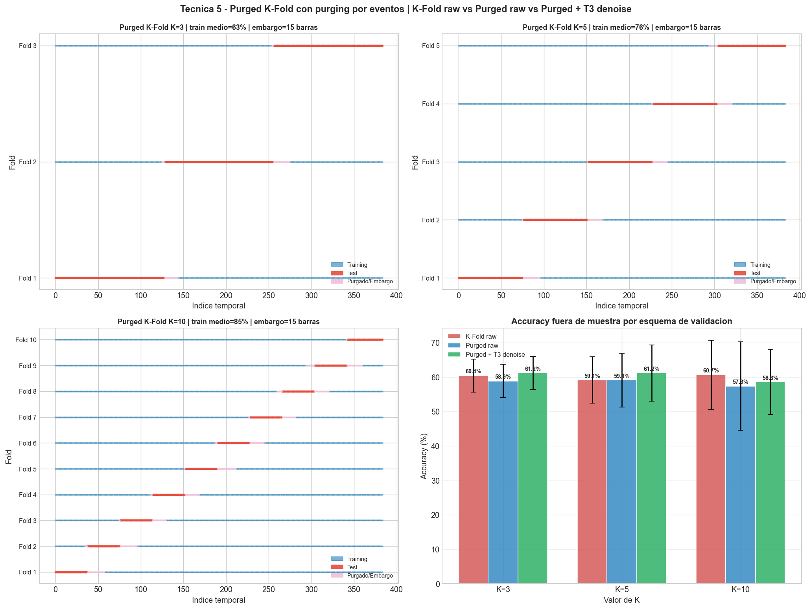

# 06 — Preprocessing for Financial ML (López de Prado)


> **TL;DR** — Five preprocessing techniques from **Marcos López de Prado's _Advances in Financial Machine Learning_** (2018), implemented end-to-end on real Binance OHLCV data for BTC, ETH, SOL, BNB, XRP. The goal is to **show, on real data, why standard ML breaks on financial time series — and how to fix it**.

---

## Why this matters

Off-the-shelf ML assumes **i.i.d.** observations. Financial data violates that systematically:

| Problem | Why it occurs |
|---|---|
| Not independent | Tomorrow's price depends on today's. |
| Distribution shift | 2008 volatility ≠ 2021 volatility. |
| Future leaks into the past | Without care, the model "sees" the future at training time. |
| Unrealistic labels | Labelling without stop-losses doesn't reflect real trading. |

> **López de Prado's core thesis:** most published strategies are false positives — they work on historical data because of **overfit**, not because they uncovered anything real.

This project implements five specific techniques from _AFML_ designed precisely to avoid those failure modes.

---

## The five techniques

### 1. Alternative bars (AFML ch. 2)
Sampling by **economic activity** (tick / volume / dollar bars) instead of clock time. Classical OHLC bars suffer from serial autocorrelation and heteroscedasticity; information-driven bars are much closer to the i.i.d. assumption.



### 2. Fractional differentiation (AFML ch. 5)
Stationarity **without losing memory**. A first difference (`x_t − x_{t−1}`) destroys all long-term information in the price. Fractional differentiation `(1 − B)^d` with `d ∈ (0, 1)` finds the **minimum `d`** that passes the ADF test while preserving the maximum possible correlation with the original series.




### 3. Covariance-matrix denoising (AFML ch. 2)
Application of **Random Matrix Theory** (Marchenko–Pastur) to separate eigenvalues associated with **real signal** from those that are **statistical noise**. Essential for portfolio construction: an un-cleaned covariance matrix is virtually useless for Markowitz optimisation when `N_assets ≈ N_observations`.




### 4. Triple-barrier labelling (AFML ch. 3)
Labelling **with implicit risk management**: for each observation, three barriers are defined (`take-profit`, `stop-loss`, `time horizon`) and the label is whichever is touched first. This is López de Prado's labelling scheme for serial time series — far closer to a trader's reality than the classical "up / down" target.




### 5. Purged K-Fold (AFML ch. 7)
Cross-validation **without temporal data leakage**. Standard K-Fold leaks future-into-past through label overlap. Purged K-Fold with **embargo** removes observations whose label overlaps with the test set and adds a downstream buffer. Without this, classifier backtests show artificially high Sharpe ratios.



---

## Data

OHLCV at 5-minute resolution for **BTC, ETH, SOL, BNB, XRP** pulled from the public Binance API, between 2023-03-15 and 2026-03-15 (~3 years). Cached locally in `cache_binance_ohlcv/` (git-ignored).

## Repository layout

```
06-preprocesado-ml/
├── Preprocesado_ML_Financiero.ipynb
├── cache_binance_ohlcv/         # local cache (gitignored)
├── t1_barras.png ... t5_purged_kfold.png    # figures used in this README
├── requirements.txt
└── README.md
```

## How to run

```bash
cd 06-preprocesado-ml
python -m venv .venv && .venv\Scripts\activate
pip install -r requirements.txt
jupyter lab Preprocesado_ML_Financiero.ipynb
```

The notebook downloads data from Binance on first run and caches it locally.

## References

- López de Prado, M. (2018). _Advances in Financial Machine Learning_. Wiley.
- López de Prado, M. (2020). _Machine Learning for Asset Managers_. Cambridge Elements.
- Marchenko, V. A., Pastur, L. A. (1967). _Distribution of eigenvalues for some sets of random matrices_.
